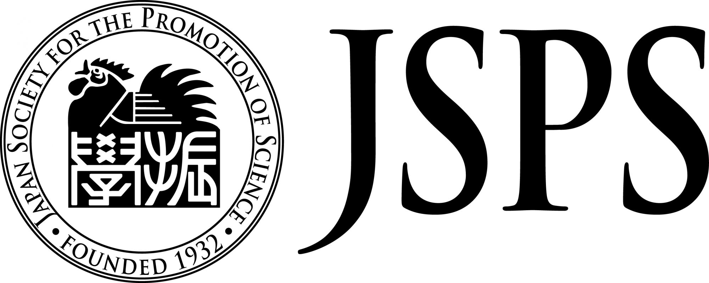

<div align="center">

# <span style="color:blue;">pLMSNOSite</span> [](https://twitter.com/intent/tweet?text=Check%20out%20this%20amazing%20repository&url=https://github.com/KCLabMTU/pLMSNOSite&via=YourTwitterHandle&hashtags=github,transformers,ptmprediction,proteins)

</div>


 <p align="center">
 Use transformer-based Protein Language Model (pLM) for prediction of S-nitrosylation modification sites in protein sequences🧬
 </p>
 
---
<p align="center">
 
</p>

<p align="center">
<a href="https://www.python.org/"></a>
<a href="https://www.tensorflow.org/"></a>
<a href="https://keras.io/"></a>
<a href="https://huggingface.co/transformers/"></a>
<a href="https://pytorch.org/"></a>
<a href="https://biopython.org/"></a>
<a href="https://scikit-learn.org/"></a>
<a href="https://matplotlib.org/"></a>
<a href="https://numpy.org/"></a>
<a href="https://pandas.pydata.org/"></a>
<a href="https://docs.python-requests.org/en/latest/"></a>
<a href="https://seaborn.pydata.org/"></a>
<a href="https://tqdm.github.io/"></a>
<a href="https://xgboost.readthedocs.io/en/latest/"></a>
<a href="https://github.com/KCLabMTU/pLMSNOSite/commits/main"></a>
<a href="https://github.com/KCLabMTU/pLMSNOSite/blob/main/LICENSE"></a>
<a href="https://github.com/KCLabMTU/pLMSNOSite/pulls"></a>


 
</p>

##  About
pLMSNOSite is a robust predictor of S-nitrosylation modification sites in protein sequences. It employs an intermediate-fusion-based stacked generalization approach to harness the representational power of global contextual embeddings obtained from a transformer protein language model called `ProtT5-XL-UniRef50` combined with local contextual embeddings from the supervised word embedding layer.

### About `ProtT5-XL-UniRef50`
`ProtT5-XL-UniRef50` is a transformer-based protein language model that was developed by Google's DeepMind. This model is built on the T5 (Text-to-Text Transfer Transformer) architecture. Using the Masked Language Modelling (MLM) objective, ProtT5 was trained on the UniRef50 dataset (consisting of 45 million protein sequences) in a self-supervised fashion. This comprehensive training allows the model to effectively capture and understand the context within protein sequences, proving valuable for tasks like predicting PTM sites. More details about it are as follows:
| Dataset | No. of Layers | Hidden Layer Size | Intermediate Size | No. of Heads | Dropout | Target Length | Masking Probability | Local Batch Size | Global Batch Size | Optimizer | Learning Rate | Weight Decay | Training Steps | Warm-up Steps | Mixed Precision | No. of Parameters | System | No. of Nodes | No. of GPUs/TPUs |
|---------|---------------|-------------------|-------------------|--------------|---------|---------------|---------------------|------------------|-------------------|-----------|---------------|--------------|----------------|---------------|-----------------|------------------|--------|--------------|-----------------|
| UniRef50 | 24 | 1024 | 65536 | 16 | 0.1 | 512 | 15% | 84 | 4096 | AdaFactor | 0.01 | 0.0 | 400K/400K | 40K/40K | None | 3B | TPU Pod | 32 | 1024 |

Note. Adapted from "ProtTrans: Towards Cracking the Language of Life’s Code Through Self-Supervised Learning," by A. Elnaggar et al., 2023, *IEEE Transactions on Pattern Analysis & Machine Intelligence*, 14(8). Copyright 2023 by IEEE.

## Webserver  :globe_with_meridians:

You can access the webserver of pLMSNOSite at [kcdukkalab.org/pLMSNOSite/](http://kcdukkalab.org/pLMSNOSite/).

## Cite this article
Pratyush, P., Pokharel, S., Saigo, H. et al. pLMSNOSite: an ensemble-based approach for predicting protein S-nitrosylation sites by integrating supervised word embedding and embedding from pre-trained protein language model. BMC Bioinformatics 24, 41 (2023). https://doi.org/10.1186/s12859-023-05164-9

## Authors  :writing_hand:
Pawel Pratyush<sup>1</sup>, Suresh Pokharel<sup>1</sup>, Hiroto Saigo<sup>2</sup>, Dukka B KC<sup>1*</sup>
<br>
<sup>1</sup>Department of Computer Science, Michigan Technological University, Houghton, MI, USA.
<br>
<sup>2</sup>Department of Electrical Engineering and Computer Science, Kyushu University, 744, Motooka, Nishi-ku, 819-0395, Japan

<sup>*</sup> Corresponding Author: dbkc@mtu.edu

## Getting Started  :rocket: 

To get a local copy of the repository, you can either clone it or download it directly from GitHub.

### Clone the Repository

If you have Git installed on your system, you can clone the repository by running the following command in your terminal:

```shell
git clone git@github.com:KCLabMTU/pLMSNOSite.git
```
### Download the Repository
Alternatively, if you don't have Git or prefer not to use it, you can download the repository directly from GitHub. Click [here](https://github.com/KCLabMTU/pLMSNOSite/archive/refs/heads/main.zip) to download the repository as a zip file.

Note: In the 'Download the Repository' section, the link provided is a direct download link to the repository's `main` branch as a zip file. This may differ if your repository's default branch is named differently.

## Install Libraries

Python version: `3.9.7`

To install the required libraries, run the following command:

```shell
pip install -r requirements.txt
```

Required libraries and versions: 
<code>
Bio==1.5.2
keras==2.9.0
matplotlib==3.5.1
numpy==1.23.5
pandas==1.5.0
requests==2.27.1
scikit_learn==1.2.0
seaborn==0.11.2
tensorflow==2.9.1
torch==1.11.0
tqdm==4.63.0
transformers==4.18.0
xgboost==1.5.0
</code>

## Install Transformers
```shell
pip install -q SentencePiece transformers
```
## Evaluate pLMSNOSite on Independent Test Set
To evaluate our model on the independent test set, we have already placed the test sequences and corresponding ProtT5 features in `data/test/` folder. After installing all the requirements, run the following command:
<br>
```shell
 python evaluate_model.py
```

## Predict S-Nitrosylation modification in your own sequence
1. Place your FASTA file in the `input/sequence.fasta` directory.
2. Run the following command:
   ```shell
   python predict.py
   ```
3. Find the results at `output/` folder.

## Training and other experiments
1. Find training data at `data/train/` folder
2. Find all the codes and models related to training at `training_experiments` folder (To be updated).

## Notes  :memo: 
1. The prediction runtime directly depends on the length of the input sequence. Longer sequences require more time for ProtT5 to generate feature vectors, and consequently, more time is needed for prediction.
2. Modifying the decision threshold cut-off value is simple and straightforward to meet your specific requirements. All you need to do is go to the `predict.py` file and locate line `172`. Here, you can easily change the current cut-off value of `0.5` to any desired cut-off value of your preference.

## Collaboration  :handshake: 
<p>
  <a href="https://www.mtu.edu/">
    
  </a>
  &nbsp;&nbsp;&nbsp;&nbsp;
  <a href="https://www.kyushu-u.ac.jp/en/">
    
  </a>
</p>


## Funding 
<p>
  <a href="https://www.nsf.gov/">
    
  </a>
  <a href="https://www.jsps.go.jp/english/">
    
  </a>
</p>


## Contact  :mailbox: 
For any type of inquiry related to this work, please send an email to dbkc@mtu.edu (CC: ppratyush@mtu.edu and sureshp@mtu.edu).
